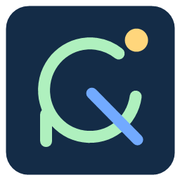

# Orchard Relay



**Build iOS apps on your Mac. Stay on Windows.**

A Windows desktop app for sending your saved Xcode project sources to a Mac over SSH, building and signing with Xcode, and installing onto an iPhone connected to that Mac.

[简体中文](README.zh-CN.md) · [Download for Windows](https://github.com/omaekumiko2-create/orchard-relay/releases/latest) · [Setup](docs/SETUP.md)

## Features

- A standalone desktop window, desktop shortcut, and system tray. The installer includes the runtime; Node.js is not required to run it.
- Standard OpenSSH and SFTP only. Uses SSH host aliases and existing SSH keys/agents.
- Multiple native Xcode projects and workspaces, Debug/Release builds, and optional team overrides.
- Source snapshots include saved uncommitted changes and unignored new files, with a SHA-256 manifest.
- A serial build queue, live logs, cancellation, retries, and reconnection to detached Mac jobs.
- Build only, build and install, or install a previously built version.
- Download signed `.app.zip` artifacts and complete logs.
- Optional signing-keychain password for one queued build, held temporarily in memory and passed over SSH; never saved in configuration, job files, or logs.

The v0.1 interface is in Simplified Chinese; English and Chinese setup guides are included.

## Quick start

1. Download `OrchardRelay-Setup-0.1.0.exe` from [Releases](https://github.com/omaekumiko2-create/orchard-relay/releases).
2. Install it and open **Orchard Relay** from your desktop.
3. Configure an SSH alias, such as `build-mac`, and verify key authentication in a terminal. See [SETUP](docs/SETUP.md).
4. In **连接设置** (Connection settings), enter that alias. An optional custom SSH config path is supported.
5. In **添加项目** (Add project), enter the Windows repository, Mac configuration directory, Xcode project/workspace, scheme, bundle ID, and source directories.
6. Connect and unlock the iPhone on the Mac. Click **检查连接** (Check connection), then **编译并安装到手机** (Build and install).

Click **仅编译** to build without a phone, or **安装此版本** in a completed build to install its existing artifact.

Closing the window leaves the app in the system tray so the queue can continue. Use the tray menu to exit. After a full exit, already-started Mac jobs continue; source transfers interrupted before remote start need retrying.

## Requirements

| Windows | Mac |
|---|---|
| Windows 10/11 x64 | Xcode with the required iOS SDK and command-line tools |
| Git, OpenSSH (`ssh`, `sftp`), and `tar` on PATH | Remote Login enabled and SSH key authentication configured |
| A local Git repository containing a directly buildable Xcode project | Python 3, a usable signing identity and development provisioning profiles |
| Network access to the Mac | iPhone paired, trusted, unlocked, and in Developer Mode for installation |

No cloud build service or Apple account credentials are included. Signing and provisioning are managed by Xcode on your Mac. A Mac is still required.

## Data and security

- The desktop app stores settings and history under `%APPDATA%/Orchard Relay`, separately from application files and updates.
- The source-development server uses `data/` by default. `ORCHARD_DATA_DIR` overrides it.
- Mac work happens under `~/.local/share/orchard-relay/`. Original repositories are not overwritten by the build worker.
- `.env` files, signing keys, provisioning profiles, Xcode user state, and configured local `.xcconfig` files are excluded from snapshots. Review your sync directories: arbitrary secrets embedded in ordinary source files cannot be automatically detected.
- SSH host-key checking is mandatory. SSH login passwords are not collected; configure keys or an agent first.
- The UI service binds to loopback on a random port in the desktop app. API calls require a random session token and pass Host/Origin checks. The renderer is sandboxed with Node integration disabled.
- No analytics, remote telemetry, or automatic updates. Local settings, jobs, keys, and application source snapshots are not part of this repository or release package.

See [SECURITY.md](SECURITY.md) for the trust model and reporting guidance.

## Scope of v0.1

This release builds directly buildable native Xcode projects. It does not install CocoaPods/Flutter/React Native dependencies or run project-generation commands. Prepare those dependencies before using it.

Artifacts are development-signed `.app.zip` files for connected devices. App Store/TestFlight archive, export, and upload are not implemented. A `Release` build here still uses the connected-device build workflow.

One Mac connection is active at a time. Changing connections is blocked while the queue is active. Historical remote artifacts require switching back to the original connection. Build caches and history are retained until you explicitly archive or remove them while idle.

The Windows installer is currently unsigned. Check that it came from this repository's Releases and compare its SHA-256 with `SHA256SUMS.txt`. Windows may show an unknown-publisher prompt.

## Development

Use Node.js 22 or newer for source development:

```sh
npm ci
npm test
npm start
```

Build the Windows installer:

```sh
npm run dist
```

Run worker tests on macOS or Linux:

```sh
python3 -m unittest discover -s tests -p '*_test.py'
```

The core backend uses Node's standard library; the Mac worker uses Python's standard library. Electron provides the desktop shell. Dependencies are pinned in `package-lock.json`.

For a browser-based development session, run `npm run server` and open the URL recorded in `data/runtime.json`. Do not share that local session URL.

## Contributing

See [CONTRIBUTING.md](CONTRIBUTING.md). Bug fixes, English UI localization, and improvements to signing diagnostics are welcome. Please use synthetic project names and redact hostnames, device identifiers, credentials, and private source in issues.

## License

[MIT](LICENSE). Electron and its bundled components retain their own licenses, included in the Windows distribution.
